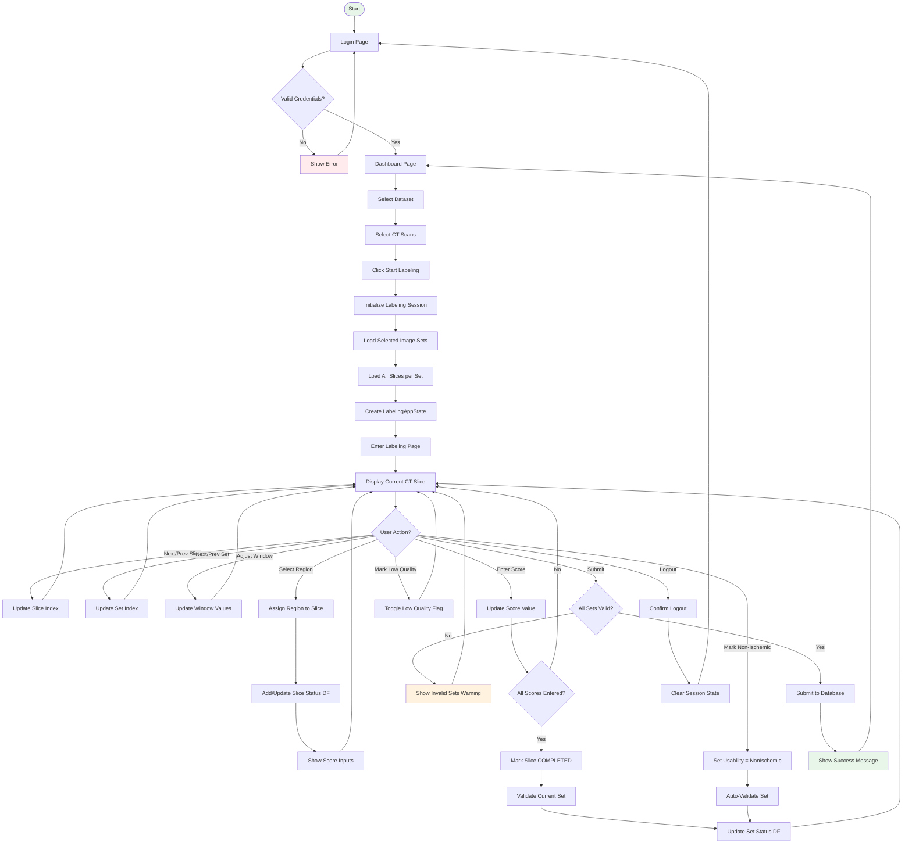
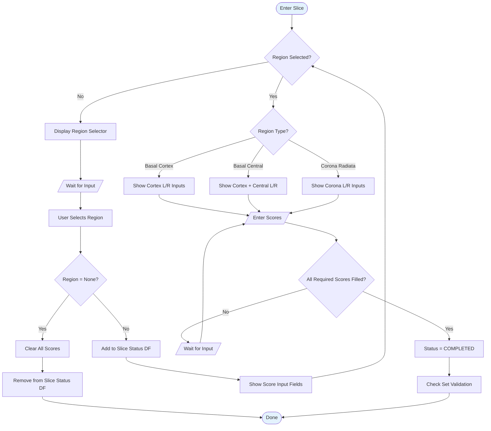
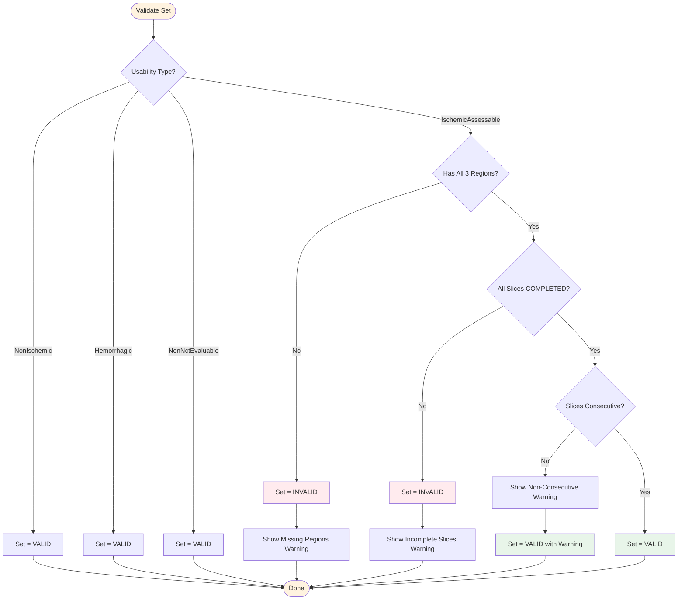

# Activity Diagram

## Overview

Activity diagrams show the workflow and decision points in the MedFabric labeling process.

---

## Complete Labeling Workflow



---

## Slice Labeling Sub-Activity



---

## Set Validation Sub-Activity



---

## Event Processing Activity

```mermaid
flowchart TD
    Start([Script Run]) --> InitFlags[Initialize EventFlags Queue]
    InitFlags --> CheckQueue{Events in Queue?}
    
    CheckQueue -->|No| RenderUI[Render UI Components]
    
    CheckQueue -->|Yes| DequeueEvent[Dequeue Event]
    DequeueEvent --> CheckEventType{Event Type?}
    
    CheckEventType -->|HalfEvent| GetWidgetValue[Get Widget Value from Key]
    GetWidgetValue --> CreateComplete[Create CompletedEvent]
    CreateComplete --> ProcessEvent
    
    CheckEventType -->|CompletedEvent| ProcessEvent[Lookup Handler in EVENT_DISPATCH]
    
    ProcessEvent --> ExecuteHandler[Execute Handler Function]
    ExecuteHandler --> UpdateState[Update App State]
    UpdateState --> UpdateStatusDFs[Update Status DataFrames]
    UpdateStatusDFs --> CheckQueue
    
    RenderUI --> RegisterCallbacks[Register Widget Callbacks]
    RegisterCallbacks --> DisplayWidgets[Display All Widgets]
    DisplayWidgets --> WaitInteraction[/Wait for User Interaction/]
    
    WaitInteraction --> CallbackTriggered[Callback: raise_flag()]
    CallbackTriggered --> QueueEvent[Add Event to EventFlags]
    QueueEvent --> TriggerRerun[Streamlit Reruns Script]
    TriggerRerun --> Start
    
    style Start fill:#e3f2fd
    style QueueEvent fill:#fff3e0
    style TriggerRerun fill:#fff3e0
```

---

## Swimlane Diagram (Cross-Functional)

```
┌─────────────────────────────────────────────────────────────────────────────────────┐
│                              LABELING WORKFLOW                                       │
├─────────────────┬─────────────────────┬─────────────────────┬───────────────────────┤
│     User        │      UI Layer       │    State Layer      │    Database Layer     │
├─────────────────┼─────────────────────┼─────────────────────┼───────────────────────┤
│                 │                     │                     │                       │
│ ○ Start         │                     │                     │                       │
│ │               │                     │                     │                       │
│ ▼               │                     │                     │                       │
│ Enter Credentials───▶ Login Form      │                     │                       │
│                 │     │               │                     │                       │
│                 │     ▼               │                     │                       │
│                 │ Validate ──────────────────────────────────────▶ Check Credentials │
│                 │     │               │                     │         │             │
│                 │     ◄───────────────────────────────────────────────┘             │
│                 │     │               │                     │                       │
│ ◄────────────────── Dashboard         │                     │                       │
│                 │                     │                     │                       │
│ Select Scans ──────▶ Checkbox Grid    │                     │                       │
│                 │     │               │                     │                       │
│ Start Labeling ────▶ Button Click     │                     │                       │
│                 │     │               │                     │                       │
│                 │     └──────────────────▶ Initialize       │                       │
│                 │                     │   Session           │                       │
│                 │                     │     │               │                       │
│                 │                     │     └──────────────────────▶ Load ImageSets │
│                 │                     │     ◄────────────────────────────┘          │
│                 │                     │     │               │                       │
│                 │                     │ Create State        │                       │
│                 │                     │     │               │                       │
│                 │ ◄───────────────────────┘                 │                       │
│ ◄────────────────── Labeling Page     │                     │                       │
│                 │                     │                     │                       │
│ Click Widget ─────▶ Callback          │                     │                       │
│                 │     │               │                     │                       │
│                 │     └──────────────────▶ Queue Event      │                       │
│                 │                     │     │               │                       │
│                 │ Rerun ◄─────────────────┘                 │                       │
│                 │     │               │                     │                       │
│                 │     └──────────────────▶ Process Event    │                       │
│                 │                     │     │               │                       │
│                 │                     │ Update State        │                       │
│                 │                     │     │               │                       │
│                 │ ◄───────────────────────┘                 │                       │
│ ◄────────────────── Render Updated UI │                     │                       │
│                 │                     │                     │                       │
│ Submit ────────────▶ Submit Button    │                     │                       │
│                 │     │               │                     │                       │
│                 │     └──────────────────▶ Validate         │                       │
│                 │                     │     │               │                       │
│                 │                     │     └──────────────────────▶ Save Results   │
│                 │                     │                     │         │             │
│                 │ ◄─────────────────────────────────────────────────┘               │
│ ◄────────────────── Success           │                     │                       │
│                 │                     │                     │                       │
│ ● End           │                     │                     │                       │
│                 │                     │                     │                       │
└─────────────────┴─────────────────────┴─────────────────────┴───────────────────────┘
```

---

## Activity Notation Legend

| Symbol | Meaning |
|--------|---------|
| ○ | Initial State |
| ● | Final State |
| ◇ | Decision Point |
| ▭ | Action/Activity |
| ⬚ | Sub-Activity |
| ═══ | Swimlane Boundary |
| /text/ | Wait State/Delay |
| ──▶ | Control Flow |
| - - ▶ | Object Flow |
