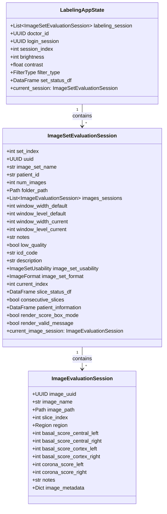
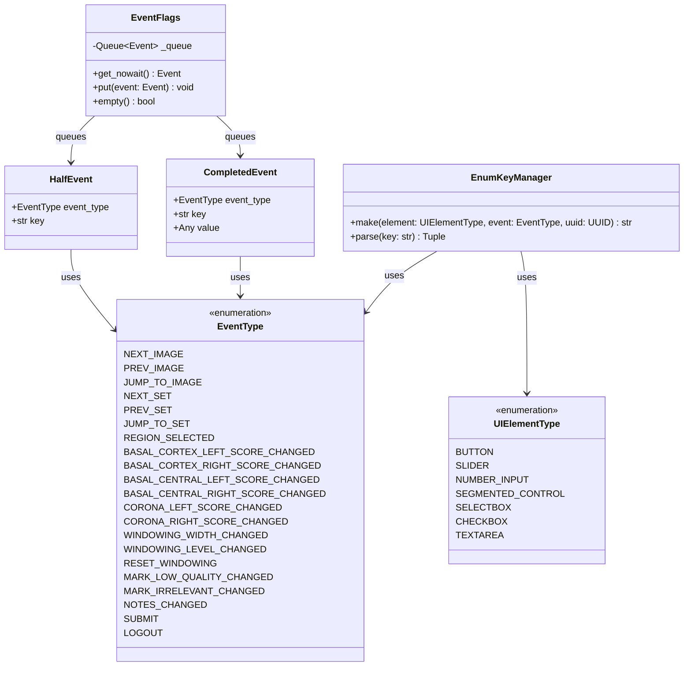
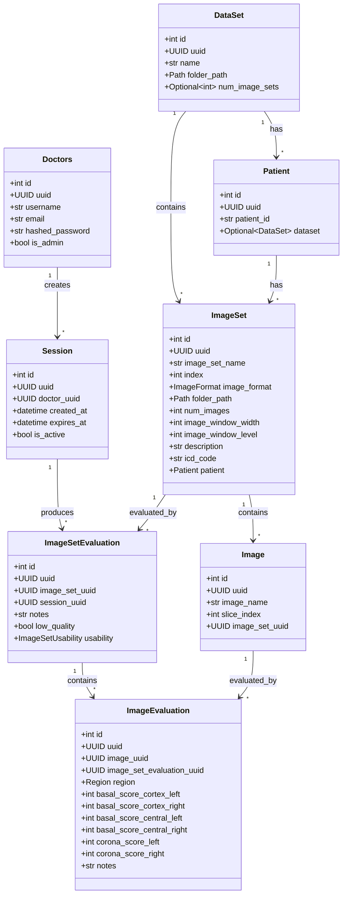
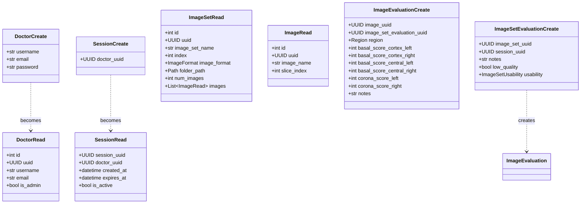
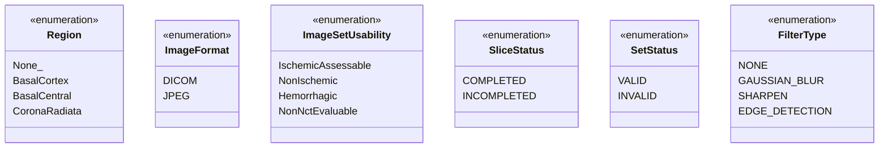
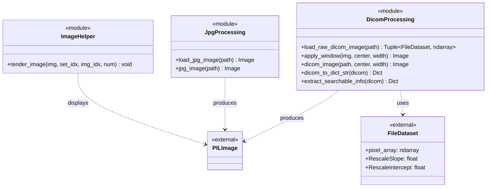
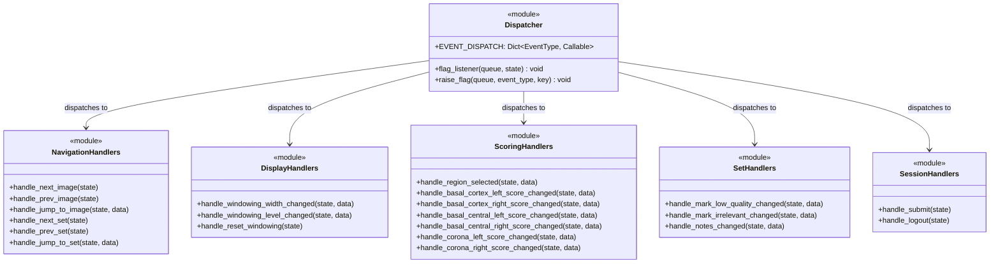

# Class Diagram

## Overview

Class diagrams show the structure of the system including classes, their attributes, methods, and relationships.

---

## Core Data Models

---

## Event System Classes

---

## Database ORM Models

---

## Pydantic Models (API Layer)

---

## Enumerations

---

## Image Processing Classes

---

## Dispatcher Pattern Classes

---

## Class Relationships Summary

| Relationship | Type | Description |
|--------------|------|-------------|
| LabelingAppState → ImageSetEvaluationSession | Composition | State contains sessions |
| ImageSetEvaluationSession → ImageEvaluationSession | Composition | Set contains slices |
| EventFlags → Event | Aggregation | Queue holds events |
| DataSet → ImageSet | Composition | Dataset contains sets |
| ImageSet → Image | Composition | Set contains images |
| Dispatcher → Handler | Dependency | Dispatcher calls handlers |
| ORM Model → Pydantic Model | Realization | ORM implements Pydantic interface |

---

## Design Patterns Used

| Pattern | Where Used | Purpose |
|---------|------------|---------|
| **Dataclass** | Session models | Immutable data containers |
| **Enum** | EventType, Region, etc. | Type-safe constants |
| **Factory** | EnumKeyManager.make() | Generate unique widget keys |
| **Command** | EVENT_DISPATCH | Encapsulate event handling |
| **State** | SliceStatus, SetStatus | Track object states |
| **Repository** | API layer | Abstract database access |
