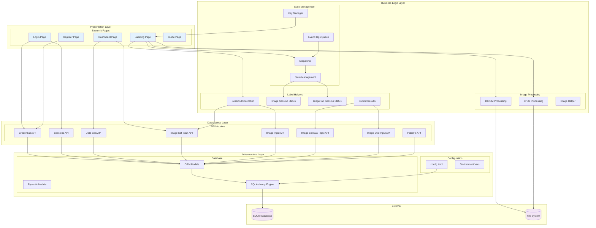
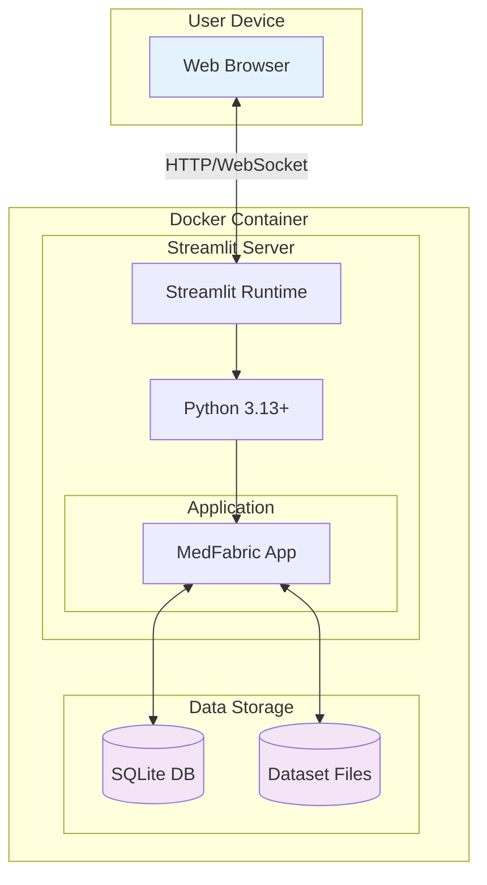
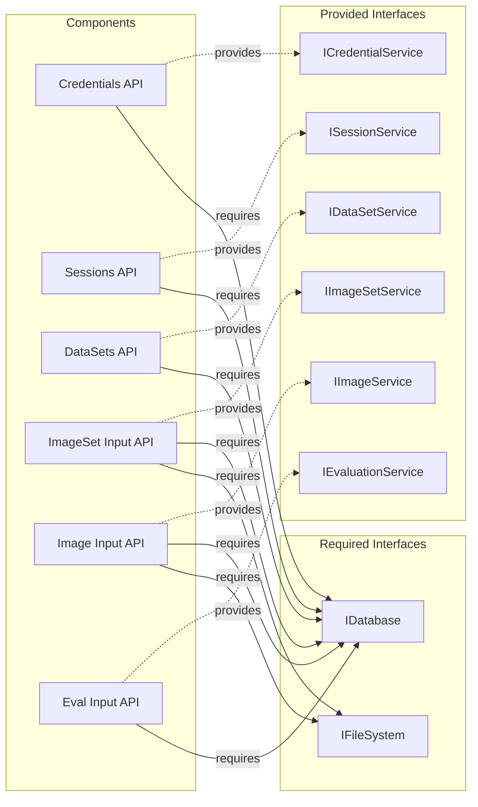

# Component Diagram

## Overview

Component diagrams show the high-level organization of the system and the relationships between major components.

---

## System Architecture



---

## Component Descriptions

### Presentation Layer

| Component | File | Responsibility |
|-----------|------|----------------|
| Login Page | `pages/login.py` | User authentication |
| Register Page | `pages/register.py` | Account creation |
| Dashboard Page | `pages/dashboard.py` | Dataset browsing, scan selection |
| Labeling Page | `pages/label.py` | Main CT scan labeling interface |
| Guide Page | `pages/guide.py` | User documentation |

### Business Logic Layer

#### State Management

| Component | File | Responsibility |
|-----------|------|----------------|
| EventFlags Queue | `label_helper/state_management.py` | Event queueing |
| Dispatcher | `label_helper/dispatcher.py` | Event routing and handling |
| State Management | `label_helper/state_management.py` | State containers (LabelingAppState) |
| Key Manager | `label_helper/state_management.py` | Widget key generation |

#### Label Helpers

| Component | File | Responsibility |
|-----------|------|----------------|
| Session Initialization | `label_helper/session_initialization.py` | Session data structures |
| Image Session Status | `label_helper/image_session_status.py` | Slice-level tracking |
| Image Set Session Status | `label_helper/image_set_session_status.py` | Set-level tracking |
| Submit Results | `label_helper/submit_results.py` | Database submission |

#### Image Processing

| Component | File | Responsibility |
|-----------|------|----------------|
| DICOM Processing | `label_helper/image_loader/dicom_processing.py` | DICOM file handling |
| JPEG Processing | `label_helper/image_loader/jpg_processing.py` | JPEG file handling |
| Image Helper | `label_helper/image_loader/image_helper.py` | Image rendering |

### Data Access Layer

| Component | File | Responsibility |
|-----------|------|----------------|
| Credentials API | `api/credentials.py` | Password hashing, validation |
| Sessions API | `api/sessions.py` | Session CRUD |
| Data Sets API | `api/data_sets.py` | Dataset CRUD |
| Patients API | `api/patients.py` | Patient CRUD |
| Image Set Input API | `api/image_set_input.py` | ImageSet CRUD |
| Image Input API | `api/image_input.py` | Image CRUD |
| Image Set Eval Input API | `api/image_set_evaluation_input.py` | Evaluation CRUD |
| Image Eval Input API | `api/image_evaluation_input.py` | Evaluation CRUD |

### Infrastructure Layer

| Component | File | Responsibility |
|-----------|------|----------------|
| ORM Models | `db/orm_model.py` | SQLAlchemy table definitions |
| Pydantic Models | `db/pydantic_model.py` | Data validation schemas |
| SQLAlchemy Engine | `db/engine.py` | Database connection |
| config.toml | `config.toml` | Application configuration |

---

## Package Diagram

```mermaid
graph TB
    subgraph medfabric
        main[main.py]
        
        subgraph pages
            login[login.py]
            register[register.py]
            dashboard[dashboard.py]
            label[label.py]
            guide[guide.py]
            
            subgraph label_helper
                state_management[state_management.py]
                dispatcher[dispatcher.py]
                session_initialization[session_initialization.py]
                image_session_status[image_session_status.py]
                image_set_session_status[image_set_session_status.py]
                submit_results[submit_results.py]
                column_config[column_config.py]
                unsatisfactory_sessions[unsatisfactory_sessions.py]
                
                subgraph image_loader
                    dicom_processing[dicom_processing.py]
                    jpg_processing[jpg_processing.py]
                    image_helper[image_helper.py]
                end
            end
        end
        
        subgraph api
            credentials[credentials.py]
            sessions[sessions.py]
            data_sets[data_sets.py]
            patients[patients.py]
            image_set_input[image_set_input.py]
            image_input[image_input.py]
            image_set_evaluation_input[image_set_evaluation_input.py]
            image_evaluation_input[image_evaluation_input.py]
            errors[errors.py]
            config[config.py]
        end
        
        subgraph db
            orm_model[orm_model.py]
            pydantic_model[pydantic_model.py]
            engine[engine.py]
        end
    end

    main --> pages
    label --> label_helper
    label_helper --> image_loader
    pages --> api
    api --> db
```



---

## Deployment Diagram



---

## Interface Diagram



---

## Component Dependencies Matrix

| Component | Depends On |
|-----------|------------|
| Login Page | Credentials API, Sessions API |
| Register Page | Credentials API |
| Dashboard | DataSets API, ImageSet Input API |
| Labeling Page | Dispatcher, Session Init, DICOM/JPEG Processing |
| Dispatcher | State Management, All Handlers |
| Session Init | ImageSet Input API, Image Input API |
| Submit Results | Eval Input APIs, Database |
| All APIs | ORM Models, Engine |
| ORM Models | SQLAlchemy, Pydantic Models |
| Engine | SQLite, config.toml |

---

## Communication Patterns

### Synchronous Communication

```
┌─────────┐     ┌─────────┐     ┌─────────┐     ┌─────────┐
│  Page   │────▶│   API   │────▶│   ORM   │────▶│   DB    │
│         │◀────│         │◀────│         │◀────│         │
└─────────┘     └─────────┘     └─────────┘     └─────────┘
     Request/Response Pattern (Blocking)
```

### Event-Driven Communication

```
┌─────────┐     ┌─────────┐     ┌─────────┐     ┌─────────┐
│ Widget  │────▶│ Callback│────▶│  Queue  │────▶│Dispatcher│
│         │     │         │     │         │     │         │
└─────────┘     └─────────┘     └─────────┘     └─────────┘
     Fire-and-Forget (Non-blocking until rerun)
```

---

## Technology Stack per Component

| Layer | Components | Technologies |
|-------|------------|--------------|
| Presentation | Pages | Streamlit 1.51+ |
| Business Logic | State, Dispatch, Helpers | Python 3.13+, Dataclasses |
| Business Logic | Image Processing | PyDICOM, Pillow, NumPy |
| Data Access | API Modules | SQLAlchemy 2.0+ |
| Data Access | Validation | Pydantic 2.12+ |
| Infrastructure | Database | SQLite |
| Infrastructure | Auth | Argon2 |
| Infrastructure | Config | TOML |
