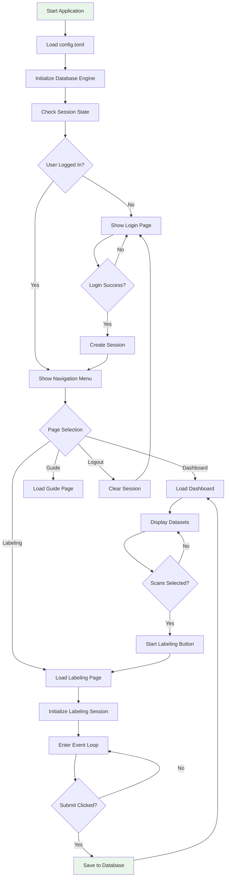
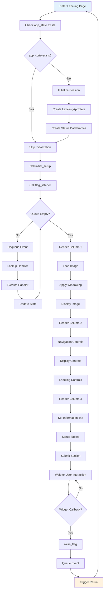
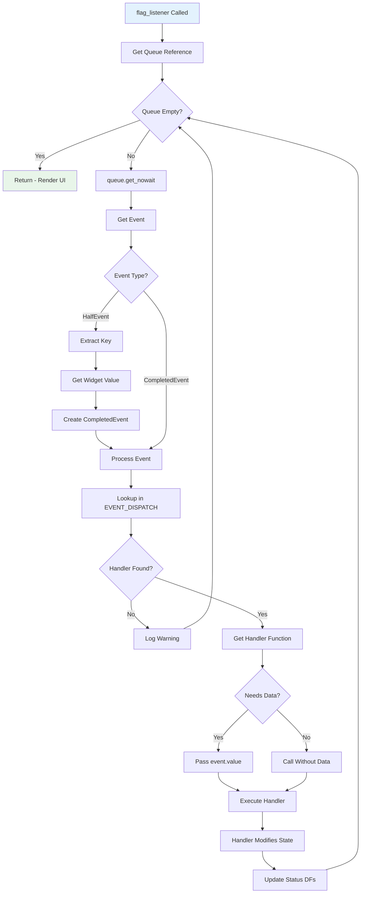
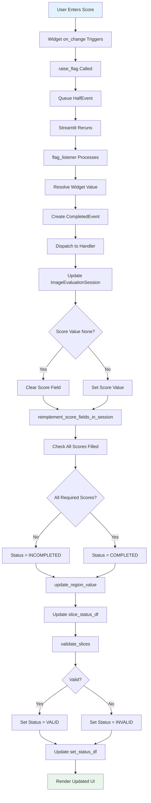
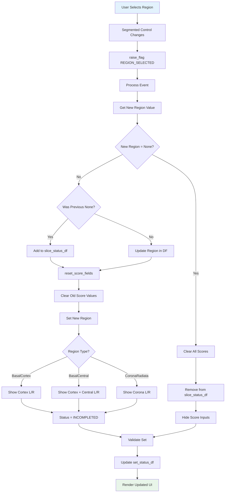
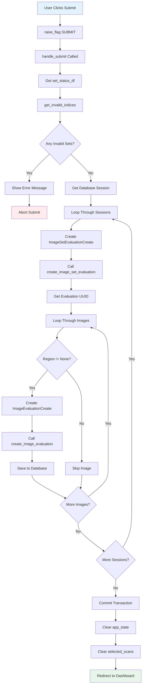
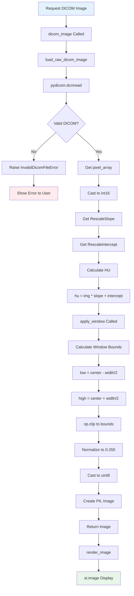
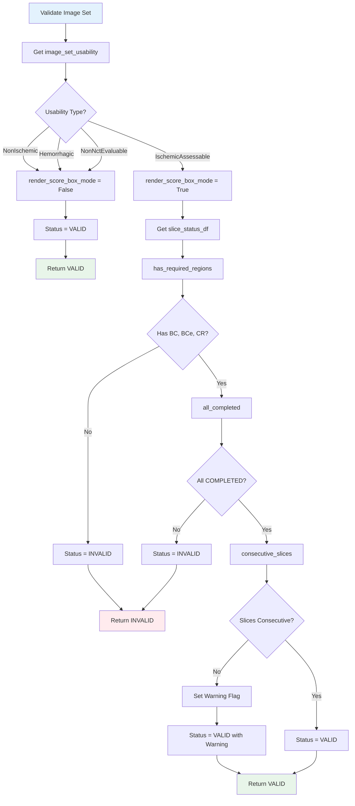
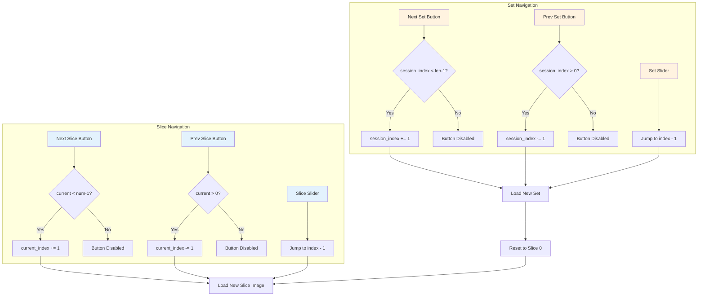

# Flowchart

## Overview

Flowcharts show the step-by-step execution flow of processes in the MedFabric system.

---

## Main Application Flow

---

## Labeling Page Event Loop

---

## Event Processing Flowchart

---

## Score Entry Flowchart

---

## Region Selection Flowchart

---

## Submit Evaluation Flowchart

---

## DICOM Image Loading Flowchart

---

## Set Validation Flowchart

---

## Navigation Flowchart

---

## Flowchart Symbols Reference

| Symbol | Meaning |
|--------|---------|
| Rounded Rectangle | Start/End (Terminal) |
| Rectangle | Process/Action |
| Diamond | Decision |
| Parallelogram | Input/Output |
| Arrow | Flow Direction |
| Dotted Line | Alternative Flow |

---

## Decision Summary

| Decision Point | True Path | False Path |
|----------------|-----------|------------|
| User Logged In? | Show Dashboard | Show Login |
| app_state exists? | Skip Init | Initialize |
| Queue Empty? | Render UI | Process Event |
| Handler Found? | Execute | Log Warning |
| All Scores Filled? | COMPLETED | INCOMPLETED |
| Has Required Regions? | Check Completed | INVALID |
| Slices Consecutive? | Clean VALID | VALID with Warning |
| Any Invalid Sets? | Show Error | Submit All |
| Valid DICOM? | Process | Show Error |
