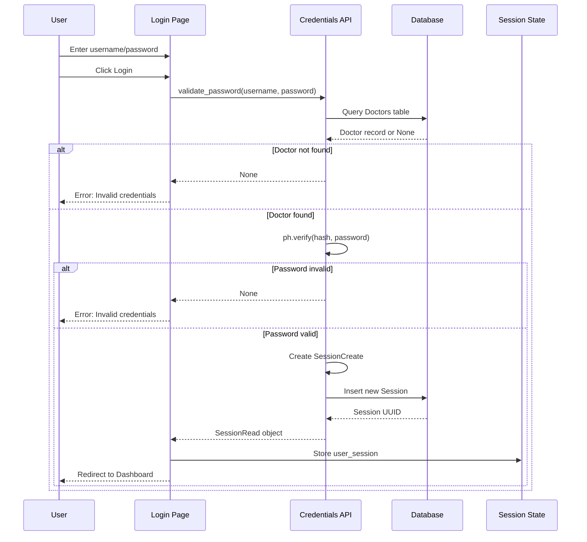
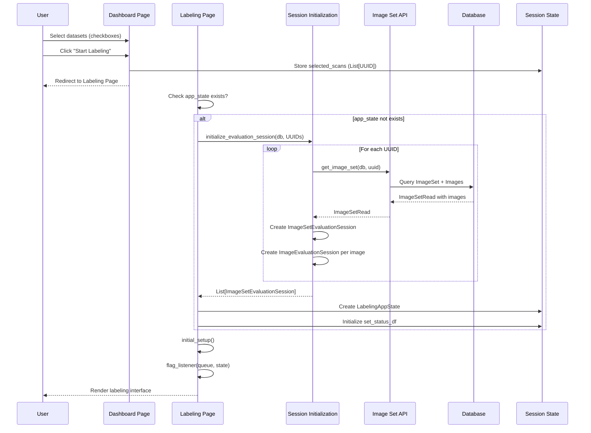
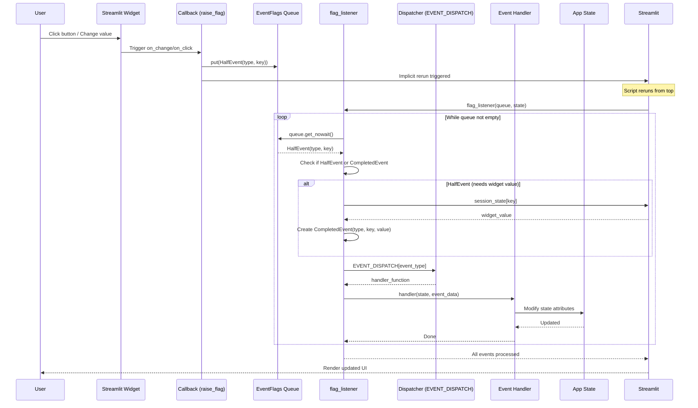
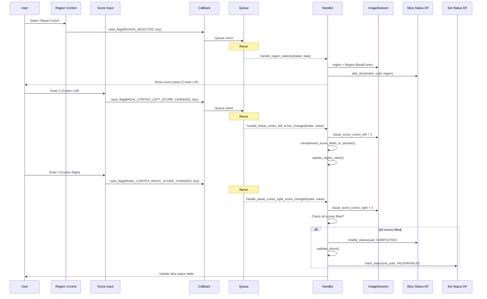
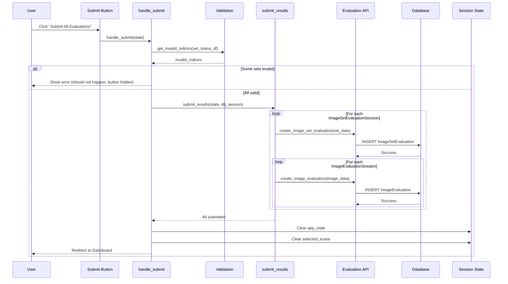
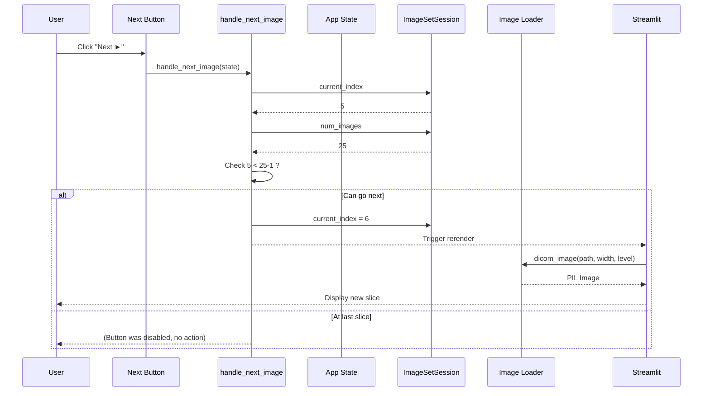
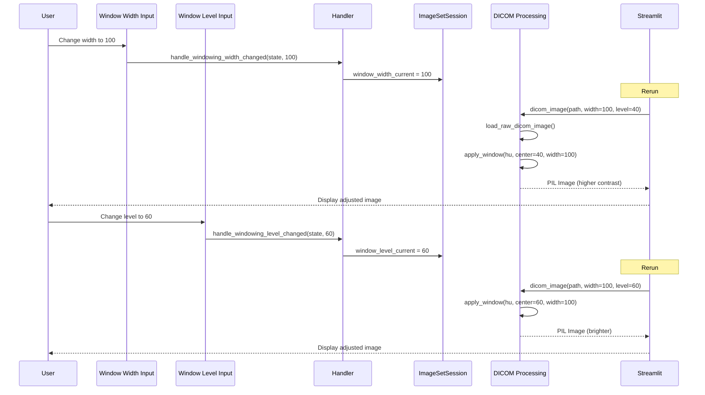

# Sequence Diagram

## Overview

Sequence diagrams show the order of interactions between objects/components over time.

---

## User Login Sequence

---

## Dashboard to Labeling Sequence

---

## Event Handling Sequence

---

## Score Entry Sequence

---

## Submit Sequence

---

## Image Navigation Sequence

---

## Window Adjustment Sequence

---

## Sequence Notation Reference

| Element | Representation |
|---------|----------------|
| Actor/Object | `participant Name` |
| Synchronous Message | `A->>B: message` |
| Async Message | `A-)B: message` |
| Return | `B-->>A: return` |
| Self-call | `A->>A: method()` |
| Note | `Note over A: text` |
| Alt/Else | `alt condition` ... `else` ... `end` |
| Loop | `loop description` ... `end` |
| Opt (optional) | `opt condition` ... `end` |
| Par (parallel) | `par` ... `and` ... `end` |
| Activation | Rectangle on lifeline |
