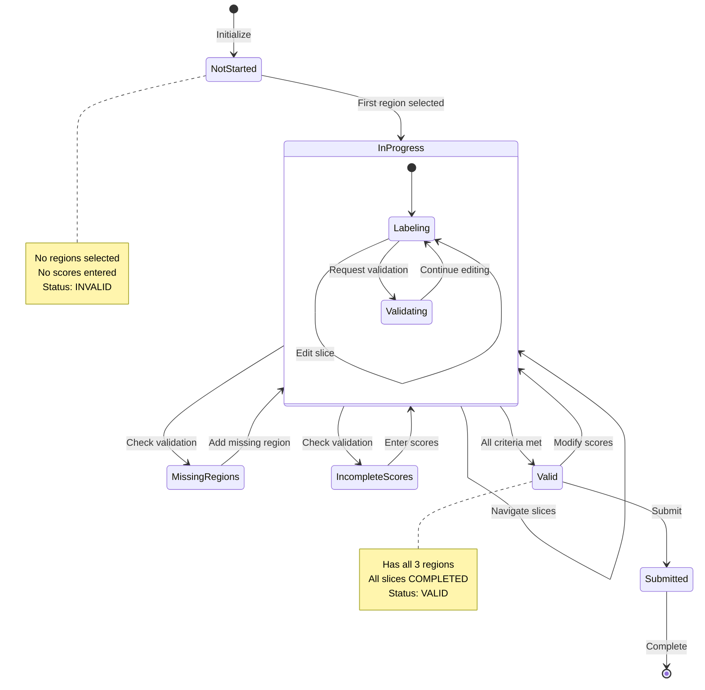
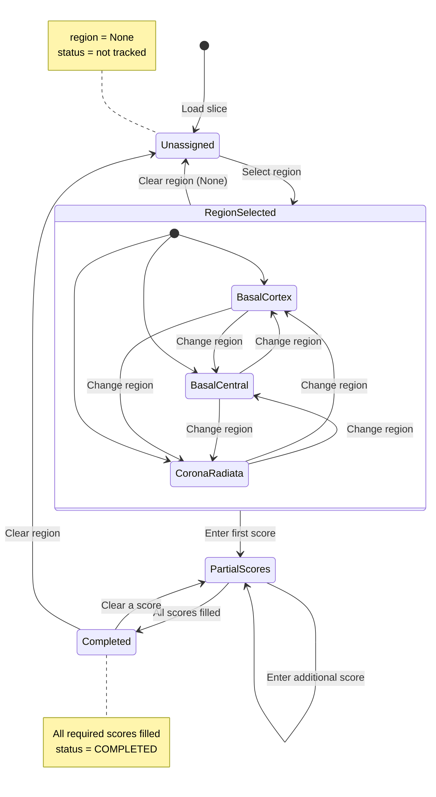
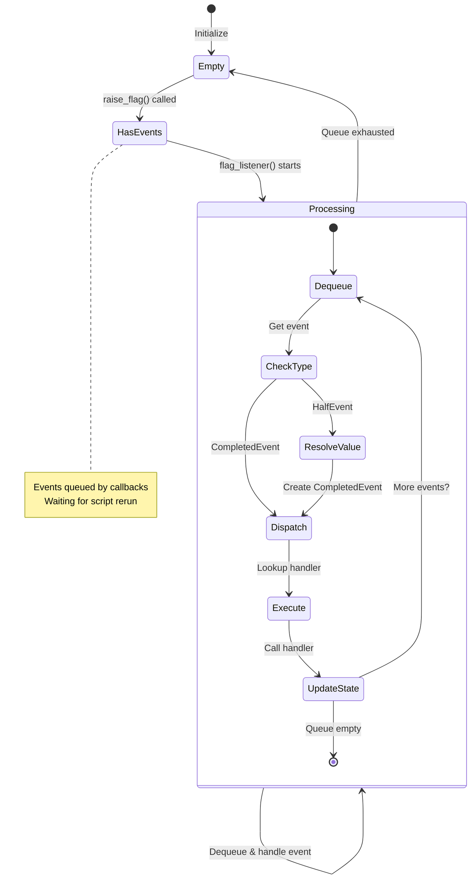
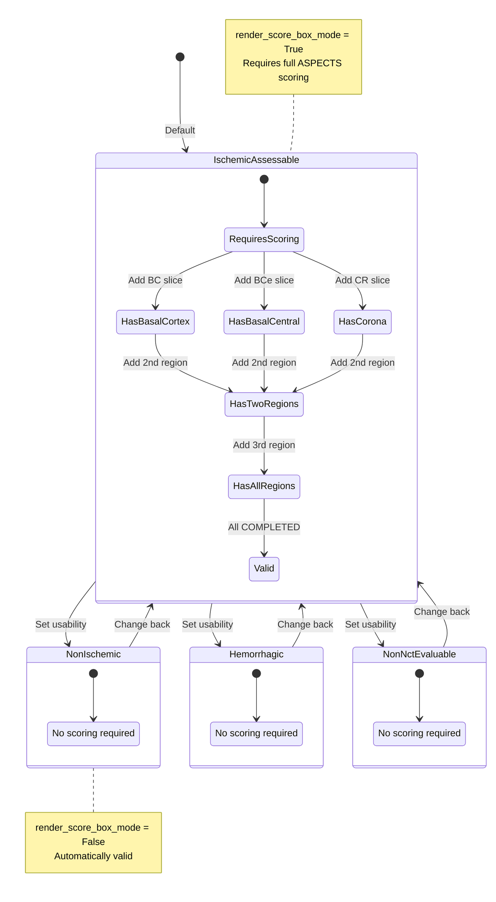
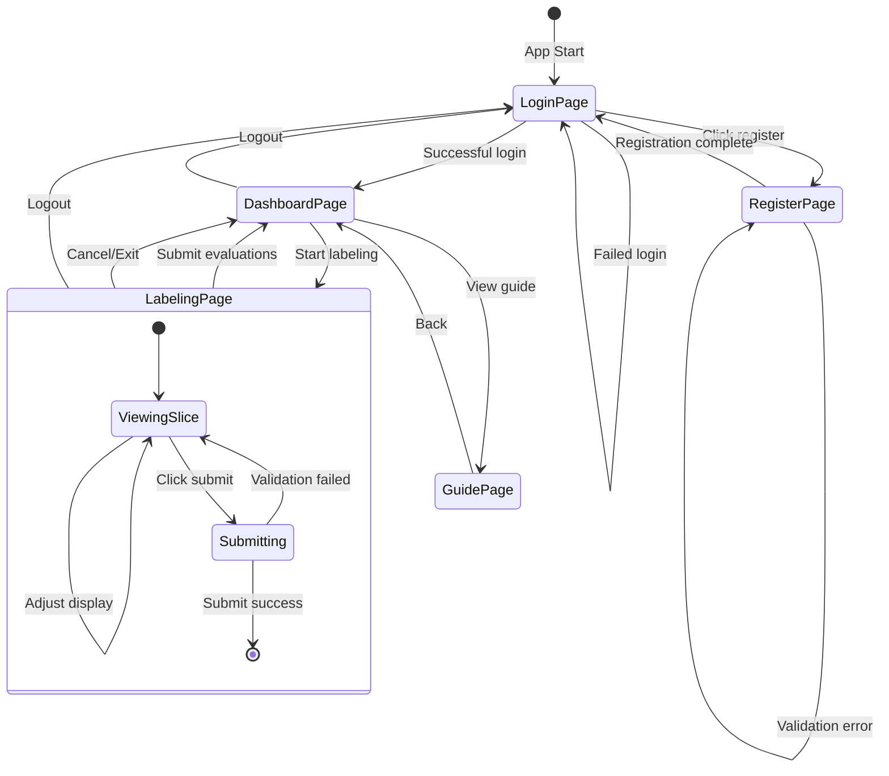

# State Diagram

## Overview

State diagrams show the different states an object or system can be in and the transitions between those states.

---

## Image Set Evaluation State Machine



---

## Slice Evaluation State Machine



---

## Event Queue State Machine



---

## Session Usability State Machine



---

## Page Navigation State Machine



---

## DICOM Windowing State

```mermaid
stateDiagram-v2
    [*] --> Default: Load image set

    Default --> CustomWidth: Change width
    Default --> CustomLevel: Change level
    
    CustomWidth --> CustomBoth: Change level
    CustomLevel --> CustomBoth: Change width
    
    CustomWidth --> Default: Reset
    CustomLevel --> Default: Reset
    CustomBoth --> Default: Reset
    
    CustomBoth --> CustomBoth: Adjust width
    CustomBoth --> CustomBoth: Adjust level

    note right of Default
        width = 80 (brain window)
        level = 40 (brain window)
    end note

    note right of CustomBoth
        width = user value
        level = user value
        Persists during session
    end note
```

---

## State Transition Tables

### Image Set Status Transitions

| Current State | Trigger | Condition | Next State |
|--------------|---------|-----------|------------|
| INVALID | Region selected | First region | INVALID |
| INVALID | Score entered | Partial | INVALID |
| INVALID | Score completed | Not all regions | INVALID |
| INVALID | All validated | All 3 regions, all complete | VALID |
| VALID | Region cleared | < 3 regions | INVALID |
| VALID | Score cleared | Slice incomplete | INVALID |
| VALID | Submit | All valid | SUBMITTED |

### Slice Status Transitions

| Current State | Trigger | Condition | Next State |
|--------------|---------|-----------|------------|
| (untracked) | Region = None → Other | Any | Added to DF |
| INCOMPLETED | Score entered | Not all filled | INCOMPLETED |
| INCOMPLETED | Score entered | All filled | COMPLETED |
| COMPLETED | Score cleared | Any | INCOMPLETED |
| (any) | Region = None | Any | Removed from DF |

---

## State Pattern Implementation

The MedFabric system doesn't use a formal state machine library but implements state logic through:

1. **Enum-based states**: `SliceStatus`, `SetStatus`, `ImageSetUsability`
2. **DataFrames for tracking**: `slice_status_df`, `set_status_df`
3. **Validation functions**: `validate_slices()`, `has_required_regions()`, `all_completed()`
4. **Event handlers**: State transitions occur within handler functions

```python
# Example: State transition in handler
def handle_basal_cortex_left_score_changed(state: LabelingAppState, value):
    # Update state
    state.current_session.current_image_session.basal_score_cortex_left = value
    
    # Check for state transition
    if all_scores_filled(state.current_session.current_image_session):
        # Transition: INCOMPLETED → COMPLETED
        state.current_session.slice_status_df = modify_status(
            state.current_session.slice_status_df,
            state.current_session.current_image_session.image_uuid,
            SliceStatus.COMPLETED
        )
        
        # Check set-level transition
        if validate_slices(state.current_session.slice_status_df):
            # Transition: INVALID → VALID
            state.set_status_df = mark_status(
                state.set_status_df,
                state.current_session.uuid,
                SetStatus.VALID
            )
```
