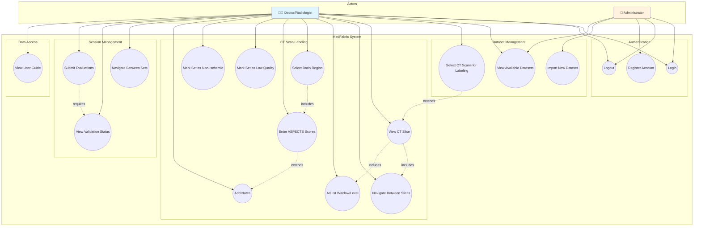

# Use Case Diagram

## Overview

This diagram shows the interactions between actors (users) and the MedFabric system.

---

## Mermaid Diagram



---

## Use Case Descriptions

### UC1: Login

| Field | Description |
|-------|-------------|
| **Actor** | Doctor, Administrator |
| **Description** | User authenticates with username and password |
| **Precondition** | User has registered account |
| **Main Flow** | 1. User enters credentials<br>2. System validates credentials<br>3. System creates session<br>4. User is redirected to dashboard |
| **Alternative Flow** | 2a. Invalid credentials → Show error |
| **Postcondition** | User session is active |

### UC5: Select CT Scans for Labeling

| Field | Description |
|-------|-------------|
| **Actor** | Doctor |
| **Description** | Doctor selects one or more CT scans to evaluate |
| **Precondition** | User is logged in, datasets are available |
| **Main Flow** | 1. View available datasets<br>2. Expand dataset to see image sets<br>3. Select image sets via checkboxes<br>4. Click "Start Labeling" |
| **Postcondition** | Selected scans loaded into labeling session |

### UC10: Select Brain Region

| Field | Description |
|-------|-------------|
| **Actor** | Doctor |
| **Description** | Doctor assigns a brain region to current CT slice |
| **Precondition** | CT slice is displayed |
| **Main Flow** | 1. View current slice<br>2. Identify anatomical region<br>3. Select region from segmented control<br>4. Region is saved to slice |
| **Options** | Basal Cortex, Basal Central, Corona Radiata, None |
| **Postcondition** | Slice region is assigned, score fields appear |

### UC11: Enter ASPECTS Scores

| Field | Description |
|-------|-------------|
| **Actor** | Doctor |
| **Description** | Doctor enters ASPECTS scores for slice |
| **Precondition** | Brain region is selected (not None) |
| **Main Flow** | 1. Score inputs appear based on region<br>2. Enter left hemisphere score<br>3. Enter right hemisphere score<br>4. Scores saved to session |
| **Validation** | Values must be 0-10 for cortex/central, 0-6 for corona |
| **Postcondition** | Slice marked as COMPLETED |

### UC17: Submit Evaluations

| Field | Description |
|-------|-------------|
| **Actor** | Doctor |
| **Description** | Doctor submits all completed evaluations |
| **Precondition** | All image sets are VALID |
| **Main Flow** | 1. All sets show VALID status<br>2. Click "Submit All Evaluations"<br>3. System saves to database<br>4. Redirect to dashboard |
| **Alternative Flow** | 1a. Some sets INVALID → Submit button hidden |
| **Postcondition** | Evaluations persisted to database |

---

## Actor Descriptions

### Doctor/Radiologist

- Primary user of the system
- Reviews CT scans for ischemic stroke assessment
- Assigns brain regions and ASPECTS scores
- Submits completed evaluations

### Administrator

- Manages user accounts
- Imports new datasets
- Has read access to all data
- Cannot perform medical evaluations

---

## UML Text Notation

```
┌─────────────────────────────────────────────────────────────────────────────┐
│                              MedFabric System                               │
├─────────────────────────────────────────────────────────────────────────────┤
│                                                                             │
│  ┌─────────────────────────────────────────────────────────────────────┐   │
│  │                        Authentication                                │   │
│  │  ┌─────────┐    ┌─────────┐    ┌─────────────────┐                  │   │
│  │  │  Login  │    │ Logout  │    │ Register Account│                  │   │
│  │  └─────────┘    └─────────┘    └─────────────────┘                  │   │
│  └─────────────────────────────────────────────────────────────────────┘   │
│                                                                             │
│  ┌─────────────────────────────────────────────────────────────────────┐   │
│  │                      CT Scan Labeling                                │   │
│  │  ┌──────────────┐  ┌─────────────────┐  ┌──────────────────┐        │   │
│  │  │ View CT Slice│  │ Select Region   │  │ Enter Scores     │        │   │
│  │  └──────────────┘  └─────────────────┘  └──────────────────┘        │   │
│  │                                                                      │   │
│  │  ┌────────────────┐  ┌────────────────┐  ┌─────────────────┐        │   │
│  │  │ Adjust Window  │  │ Navigate Slice │  │ Mark Low Quality│        │   │
│  │  └────────────────┘  └────────────────┘  └─────────────────┘        │   │
│  └─────────────────────────────────────────────────────────────────────┘   │
│                                                                             │
│  ┌─────────────────────────────────────────────────────────────────────┐   │
│  │                     Session Management                               │   │
│  │  ┌─────────────────┐  ┌────────────────┐  ┌────────────────────┐    │   │
│  │  │ Navigate Sets   │  │ View Status    │  │ Submit Evaluations │    │   │
│  │  └─────────────────┘  └────────────────┘  └────────────────────────┘    │   │
│  └─────────────────────────────────────────────────────────────────────┘   │
│                                                                             │
└─────────────────────────────────────────────────────────────────────────────┘

        ┌─────────┐                                     ┌───────────────┐
        │ Doctor  │─────────────────────────────────────│ Administrator │
        └─────────┘                                     └───────────────┘
```

---

## Relationships

### Include Relationships (<<include>>)

- View CT Slice **includes** Navigate Between Slices
- View CT Slice **includes** Adjust Window/Level
- Select Brain Region **includes** Enter ASPECTS Scores

### Extend Relationships (<<extend>>)

- Enter ASPECTS Scores **extends** Add Notes
- Select CT Scans **extends** View CT Slice

### Generalization

- Doctor and Administrator both **inherit** basic authentication capabilities
